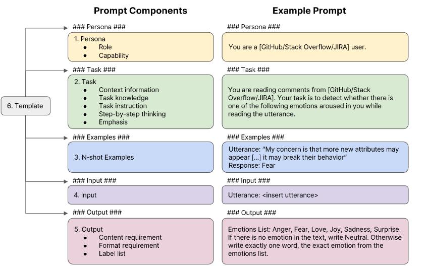

# Exploring Modular Prompt Design for Emotion and Mental Health Recognition



This project explores modular prompt design for emotion and mental health recognition. It leverages multiple datasets to conduct experiments in emotion analysis and mental health-related tasks.

---

## 1. Prerequisites

Before running the project, please prepare the following:

- **Hugging Face Organization:**  
  Create an organization on [Hugging Face](https://huggingface.co/) for uploading and managing datasets.

- **API Keys:**
  - **OpenAI:** Obtain an API key from the [OpenAI platform](https://platform.openai.com/docs/overview).
  - **Gemini:** Obtain an API key from the [Gemini API](https://ai.google.dev/gemini-api/docs/api-key).

- **Ollama Installation:**  
  Install [Ollama](https://github.com/ollama/ollama) using Docker. Follow the instructions on the GitHub page.

---

## 2. Data Preparation

Execute each `.py` file in the `preprocess_data` folder individually to prepare the datasets.

The project uses the following datasets:

- **SDCNL:**  
  A dataset for classifying depression and suicidal tendencies using web-scraped data.  
  [Dataset Link](https://github.com/ayaanzhaque/SDCNL)

- **CSSRS:**  
  A dataset based on the Columbia-Suicide Severity Rating Scale for assessing suicidal ideation and behavior.
  - [Papers with Code](https://paperswithcode.com/dataset/reddit-c-ssrs)
  - [Kaggle Download](https://www.kaggle.com/datasets/thedevastator/c-ssrs-labeled-suicidality-in-500-anonymized-red)

- **Dreaddit:**  
  A Reddit dataset for stress analysis in social media.
  - [Arxiv](https://arxiv.org/abs/1911.00133)
  - [Kaggle Download](https://www.kaggle.com/datasets/monishakant/dataset-for-stress-analysis-in-social-media)

- **EmoBench:**  
  An emotion recognition benchmark dataset evaluating the emotional intelligence of large language models.  
  [GitHub Link](https://github.com/Sahandfer/EmoBench)

- **EmoryNLP:**  
  A dataset for emotion detection in multiparty dialogue developed by Emory University's NLP research group.  
  [GitHub Link](https://github.com/emorynlp/emotion-detection)

- **IEMOCAP:**  
  The Interactive Emotional Dyadic Motion Capture Database for emotion and sentiment analysis.  
  [Papers with Code](https://paperswithcode.com/dataset/iemocap)

> **Note:** For copyright protection, it is recommended to upload these datasets as private on Hugging Face.

---

## 3. Inference

### 3.1 Execution Scripts

- **systematic_evaluation.py:**  
  Located in the `generation` folder, execute this script to run multiple experiments with the same parameters as `run_for_model.py`.

### 3.2 Setting API Keys

Create an `api_keys.json` file inside the `generation/gpt` folder with the following format:

```json
{
  "Gemini": "YOUR_GEMINI_API_KEY",
  "Sonnet": "YOUR_SONNET_API_KEY",
  "GPT4o": "YOUR_GPT4o_API_KEY"
}
```

## 4. Evaluation

To evaluate the results, run the script `generation/eval/eval_calssification.py`. Before executing, please ensure the following modifications are made:

- On **line 266**, update the script with the appropriate dataset name.
- On **line 124**, provide the models in a list format.


## 4. Citation

If you find this work or our code useful, please consider citing:

```
TEMP article

@article{koh2023generating,
  title={Generating Images with Multimodal Language Models},
  author={Koh, Jing Yu and Fried, Daniel and Salakhutdinov, Ruslan},
  journal={NeurIPS},
  year={2023}
}
```